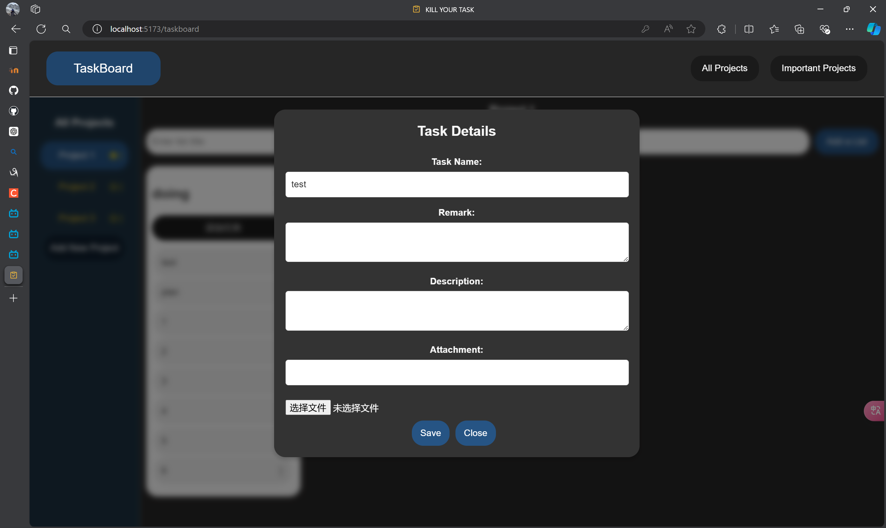

# NJUWebDev

After great summer class, I`m trying to make a web app.

## 如何运行它

* 在frontend/signboard下：

```apl
npm install
npm run dev
```

* 在backend/signboard下：

```apl
npm install
npm run dev
yes
```

## 由于开发上的局限，请在深色模式下使用网页

## 网页功能简介

* 引导界面


* 登录界面

  在登录界面实现websocket实现前后端通讯

  可以实现多用户登录，已经录入用户有

  “email:123456@163.com

  password:123456

  email:1607389925@qq.com

  password:123456”


* 主界面，任务版

```python
1.在左侧选择想要查看的项目
2.点击左上角会退出返回导航页
3.右上方为项目分类，分为所有项目和重要（星标项目）点击会改变左侧显示的任项目内容
4.左侧项目栏三个点为操作点，可以重命名或删除项目
5.点击星号可以将项目变为星标项目
6.左侧栏下方可以添加新项目
```


* 任务界面

```python
1.在右侧项目名称下方输入要创建的任务名，点击右侧添加即可添加新的列
2.任务名右侧操作点可以用于任务归档
3.每列任务下方的小任务右侧操作点可以对没小项任务进行各种操作
```


* 任务操作

```python
1.第一行可以更改任务名称
2.第二行可以对任务进行评论
3.第三行对任务进行描述
4.第四行用于添加附件连接
5.最后可以选择上传附件
6.点击保存可以保存设置，close关闭设置
```



